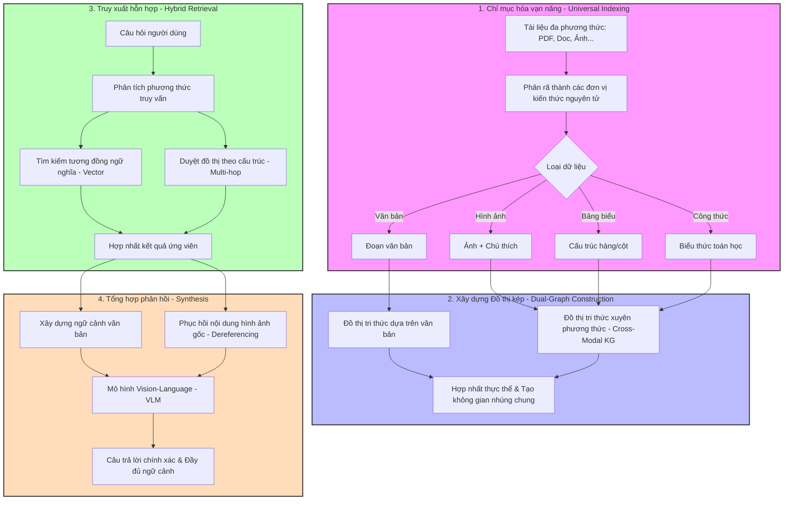

<div align="center">

<p>
  
</p>

# 🚀 RAG-Anything: All-in-One RAG Framework

<p>
  <a href="https://trendshift.io/repositories/14959" target="_blank">
    
  </a>
</p>

<p>
  
</p>

<p>
  <a href="https://github.com/HKUDS/RAG-Anything">
    
  </a>
  <a href="https://arxiv.org/abs/2510.12323">
    
  </a>
  <a href="https://github.com/HKUDS/LightRAG">
    
  </a>
</p>

<p>
  <a href="https://github.com/HKUDS/RAG-Anything/stargazers">
    
  </a>
  
  <a href="https://pypi.org/project/raganything/">
    
  </a>
  <a href="https://github.com/astral-sh/uv">
    
  </a>
</p>

<p>
  <a href="https://discord.gg/yF2MmDJyGJ">
    
  </a>
  <a href="https://github.com/HKUDS/RAG-Anything/issues/7">
    
  </a>
</p>

<p>
  <a href="README_zh.md">
    
  </a>
  <a href="README.md">
    
  </a>
</p>

</div>

---

<div align="center">
  <a href="#-quick-start">
    
  </a>
</div>

---

<div align="center">
  <a href="https://litewrite.ai">
    
  </a>
  <br/><br/>
  <a href="https://litewrite.ai">
    
  </a>
</div>


---

<div align="center">
  
</div>
---

# 🚀 RAG-Anything: Framework RAG Tất Cả Trong Một

> Hệ thống RAG đa phương thức (Multimodal RAG) xử lý văn bản, hình ảnh, bảng biểu, công thức toán và nhiều định dạng tài liệu khác trong một pipeline thống nhất.

---

## 🎯 Giới Thiệu

**RAG-Anything** là một framework RAG đa phương thức được xây dựng trên nền tảng LightRAG, cho phép:

- Xử lý tài liệu chứa nhiều loại nội dung (text, image, table, equation…)
- Truy vấn thông minh dựa trên Vector Search kết hợp Knowledge Graph
- Hỗ trợ nhiều định dạng: PDF, Office, ảnh, Markdown, TXT
- Tích hợp Vision-Language Model (VLM) để phân tích hình ảnh trong ngữ cảnh

Khác với hệ thống RAG truyền thống chỉ xử lý văn bản, RAG-Anything cung cấp khả năng truy xuất và hiểu nội dung đa phương thức trong một hệ thống thống nhất.

---

## ✨ Tính Năng Chính

- 🔄 Pipeline xử lý đa phương thức đầu-cuối  
- 📄 Hỗ trợ nhiều định dạng tài liệu  
- 🧠 Phân tích chuyên biệt cho ảnh, bảng và công thức toán  
- 🔗 Xây dựng Multimodal Knowledge Graph  
- ⚡ Truy xuất Hybrid (Vector + Graph)  
- 🎯 Truy vấn nâng cao với VLM  
- 📋 Chèn trực tiếp danh sách nội dung đã parse  

---

## 🏗️ Kiến Trúc Hệ Thống

Pipeline xử lý gồm 5 giai đoạn chính:

1. 📄 Document Parsing  
2. 🧠 Multimodal Content Processing  
3. 🔍 Knowledge Graph Construction  
4. ⚖️ Weighted Relationship Scoring  
5. 🚀 Hybrid Retrieval (Vector + Graph)  



---

## 📦 Cài Đặt

### 🔹 Cài từ PyPI (Khuyến nghị)

```bash
pip install raganything
```

Cài đầy đủ tính năng:

```bash
pip install "raganything[all]"
```

Cài theo từng module:

```bash
pip install "raganything[image]"
pip install "raganything[text]"
```

---

## ⚠️ Yêu Cầu Xử Lý Office

Để xử lý file `.doc`, `.ppt`, `.xls` cần cài LibreOffice:

**macOS:**
```bash
brew install --cask libreoffice
```

**Ubuntu:**
```bash
sudo apt install libreoffice
```

---

## 🧠 Ví Dụ Sử Dụng Cơ Bản

### 1️⃣ Xử lý tài liệu hoàn chỉnh

```python
import asyncio
from raganything import RAGAnything, RAGAnythingConfig

async def main():
    config = RAGAnythingConfig(
        working_dir="./rag_storage",
        parser="mineru",
        parse_method="auto",
        enable_image_processing=True,
        enable_table_processing=True,
        enable_equation_processing=True,
    )

    rag = RAGAnything(config=config)

    await rag.process_document_complete(
        file_path="document.pdf",
        output_dir="./output"
    )

    result = await rag.aquery(
        "Tóm tắt nội dung chính của tài liệu",
        mode="hybrid"
    )

    print(result)

asyncio.run(main())
```

---

### 2️⃣ Truy vấn đa phương thức

```python
result = await rag.aquery_with_multimodal(
    "Giải thích công thức sau",
    multimodal_content=[{
        "type": "equation",
        "latex": "P(d|q) = \\frac{P(q|d)P(d)}{P(q)}",
        "equation_caption": "Xác suất liên quan tài liệu"
    }],
    mode="hybrid"
)
```

---

### 3️⃣ Batch Processing

```python
await rag.process_folder_complete(
    folder_path="./documents",
    output_dir="./output",
    recursive=True
)
```

---

## 📋 Định Dạng Content List

```python
content_list = [
    {"type": "text", "text": "Nội dung văn bản", "page_idx": 0},
    {"type": "image", "img_path": "/abs/path/image.jpg", "page_idx": 1},
    {"type": "table", "table_body": "|A|B|", "page_idx": 2},
    {"type": "equation", "latex": "E=mc^2", "page_idx": 3}
]
```

Chèn trực tiếp:

```python
await rag.insert_content_list(
    content_list=content_list,
    file_path="paper.pdf"
)
```

---

## 🔧 Cấu Hình Environment

Tạo file `.env`:

```
OPENAI_API_KEY=your_key
OPENAI_BASE_URL=your_base_url
OUTPUT_DIR=./output
PARSER=mineru
PARSE_METHOD=auto
```

---

## 🧪 Các Loại Nội Dung Hỗ Trợ

### 📄 Định dạng tài liệu
- PDF  
- DOC / DOCX  
- PPT / PPTX  
- XLS / XLSX  
- JPG / PNG / BMP / TIFF / GIF / WebP  
- TXT / MD  

### 🧩 Thành phần đa phương thức
- Văn bản  
- Hình ảnh  
- Bảng dữ liệu  
- Công thức LaTeX  
- Nội dung tùy chỉnh  

---

## 📖 Trích Dẫn Học Thuật

```bibtex
@misc{guo2025raganythingallinoneragframework,
  title={RAG-Anything: All-in-One RAG Framework},
  author={Zirui Guo and Xubin Ren and Lingrui Xu and Jiahao Zhang and Chao Huang},
  year={2025},
  eprint={2510.12323},
  archivePrefix={arXiv},
  primaryClass={cs.AI}
}
```

---

# ⭐ Cảm ơn bạn đã sử dụng RAG-Anything!