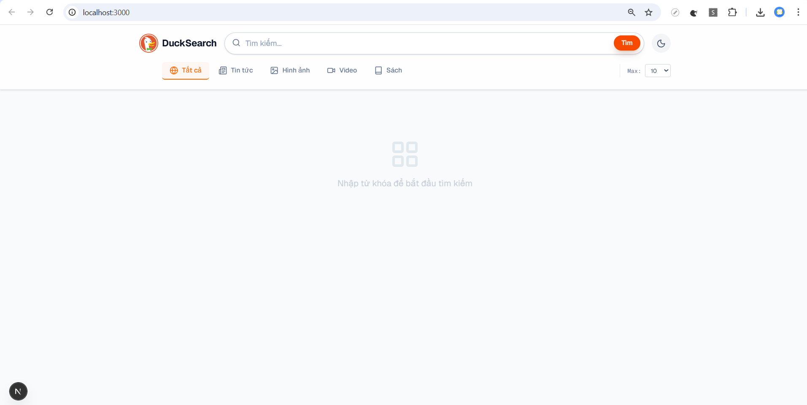

## Hướng dẫn chạy dự án DuckDuckGo UI

### Giao diện DuckDuckGo UI

<p align="center">
  
</p>

### 1. Cài đặt các package Node.js

Chạy lệnh sau trong thư mục `duckduckgo-ui`:

```bash
npm install
```

### 2. Khởi động ứng dụng Next.js (giao diện web)

```bash
npm run dev
```

Ứng dụng sẽ chạy ở địa chỉ: [http://localhost:3000](http://localhost:3000)

### 3. Cài đặt các package Python (nếu cần)

Nếu lần đầu chạy hoặc thiếu thư viện, cài đặt các package Python cần thiết cho `server.py` (ví dụ Flask, requests, ...):

```bash
pip install -r requirements.txt
# hoặc cài từng gói nếu không có requirements.txt
pip install flask requests
```

### 4. Khởi động server backend Python

Chạy lệnh sau trong thư mục `duckduckgo-ui`:

```bash
python server.py
```

Server API sẽ chạy ở địa chỉ: [http://127.0.0.1:5000](http://127.0.0.1:5000)

### 5. Truy cập giao diện tìm kiếm

Sau khi chạy cả hai lệnh trên, mở trình duyệt và truy cập [http://localhost:3000](http://localhost:3000) để sử dụng DuckDuckGo UI.

---

**Lưu ý:**
- Đảm bảo đã cài đặt Node.js, npm và Python trên máy tính.
- Nếu gặp lỗi kết nối server, kiểm tra lại xem `server.py` đã chạy chưa.
- Nếu thiếu thư viện Python, hãy cài đặt theo hướng dẫn ở bước 3.

---

## Tham khảo thêm
- [Next.js Documentation](https://nextjs.org/docs)
- [Learn Next.js](https://nextjs.org/learn)
- [Next.js GitHub](https://github.com/vercel/next.js)
